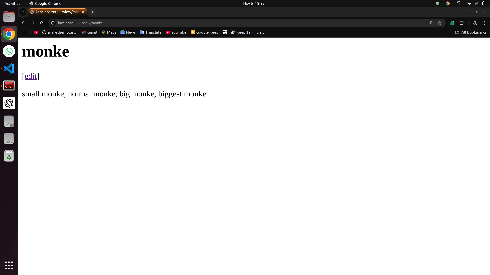

# `simple go web application`

> by: `Taib Izzat Samawi, 5025221085`

> this is a simple implementation of `go/golang` for a web application.

## `how to run`
- clone/download this repo
- open the folder
- download `go/golang`
- run `go run wiki.go`
- optionally, if you want a faster/more performant implementation:
  - run `go build wiki.go`
  - this will create a `wiki` machine code (in linux) or a `wiki.exe` executable (in windows)
  - run `./wiki` (linux) or `wiki.exe` (windows)
  
> this will open up a webpage at `localhost:8080`

## `localhost:8080/view`
> if one were to open `localhost:8080/view/<filename>` 
> 
> example: `localhost:8080/view/monke` 

### if the file `monke.txt` exists in the project:
> this will open up a page that looks like below

### otherwise, if the `monke.txt` file does not exist in the project:
> this will open up a session of `localhost:8080/edit/monke`, which we will discuss in the next section.

## `localhost:8080/edit`
> if one were to open `localhost:8080/edit/<filename>`
>
> example: `localhost:8080/edit/monke`
>
> a screen will pop up, which will look like below:

### `editing contents`
> one can edit the contents inside the text area

### `saving contents`
> one can click on the save button to commit/save changes. After clicking the `Save` button, one would be redirected to a session of `localhost:8080/view/monke`, which will show the updated contents

